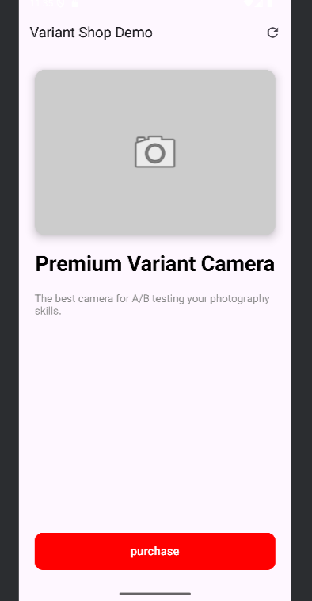
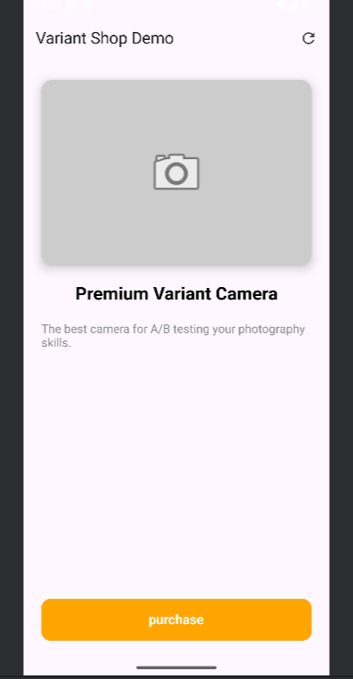

# Variant - Android Demo App 📱

[](https://kotlinlang.org)
[](https://github.com/Orimmrko/variant-sdk)
[](https://developer.android.com)

This is a sample Android application demonstrating the capabilities of the **Variant A/B Testing SDK**. 
It showcases how to toggle UI elements, change colors, and modify text dynamically from the cloud without releasing a new APK.

---

## 📸 Screenshots

See how the app changes based on the assigned experiment variant.

| Variant A (Control) | Variant B (Test) |
|:---:|:---:|
|  |  |

> *Note: These changes happen automatically based on the configuration in the Variant Dashboard.*

---

## 🛠 Setup & Run

### 1. Prerequisites
* Android Studio Iguana or later.
* Android Device or Emulator (Min SDK 21).

### 2. Clone the Repository
```bash
git clone https://github.com/Orimmrko/variant-android-demo.git
cd variant-android-demo
```

### 3. Open in Android Studio
1.  Open Android Studio.
2.  Select **Open** and choose the cloned folder.
3.  Wait for Gradle sync to complete.

### 4. Configure Keys (Optional)
The app comes pre-configured with a **Guest API Key** for demonstration purposes. 
If you want to use your own account:
1.  Open `MyApplication.kt` (or where `Variant.init` is called).
2.  Replace the `API_KEY` and `APP_ID` with your own credentials from the dashboard.

```kotlin
Variant.init(
    context = this,
    apiKey = "YOUR_OWN_KEY", 
    appId = "YOUR_APP_ID"
)
```

---

## 🧪 How to Test Experiments

To see the magic happen, follow these steps using the Admin Dashboard.

1.  **Login to Dashboard:** [https://variant-dashboard-pied.vercel.app](https://variant-dashboard-pied.vercel.app)
2.  **Create a New Experiment:**
    * **Name:** Button Color Test
    * **Key:** `btn_color` (Must match the code below)
    * **Variant A:** `blue` (Traffic: 50%)
    * **Variant B:** `red` (Traffic: 50%)
3.  **Restart the App:**
    * The app fetches configuration on startup.
    * Based on your bucket, the button will turn **Blue** or **Red**.

### Code Example
Here is the actual code running in `MainActivity.kt`:

```kotlin
// 1. Fetch the color from the server (Default is gray if offline)
val colorName = Variant.getString("btn_color", "gray")

// 2. Apply it to the UI
val colorRes = when (colorName) {
    "red" -> R.color.red_500
    "blue" -> R.color.blue_500
    else -> R.color.gray_500
}

actionButton.setBackgroundColor(ContextCompat.getColor(this, colorRes))
```

---

## 📄 License

This project is licensed under the MIT License.
